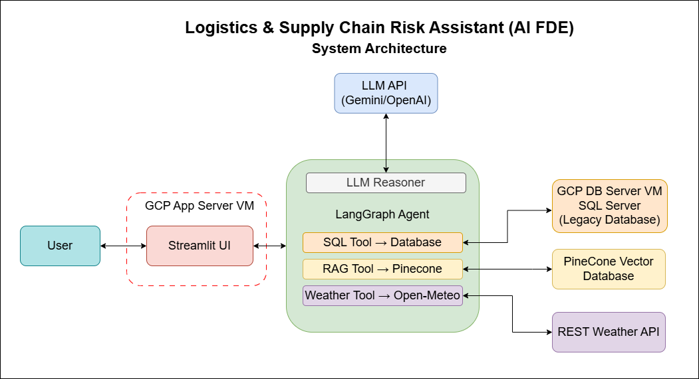

# 🚛 Logistics & Supply Chain Risk Assistant (AI FDE)

An AI agent that lets logistics dispatchers and business stakeholders **"chat with their data"** about cold-chain anomalies, route disruptions, and compliance risk.

The agent is built with **LangGraph**. For each question it combines three sources:

1. **Legacy fleet telemetry** from a Microsoft SQL Server database, queried through a read-only semantic view.
2. **Live corridor conditions** (weather and wind) from the Open-Meteo REST API.
3. **Standard Operating Procedures (SOPs)** retrieved from a Pinecone vector index (RAG).

It then writes a short business report: an executive summary, a telemetry table, and an action plan that cites the relevant SOP. Every tool call and response is written to an audit table, which administrators can view in the UI.

---

## Architecture



The agent runs inside a single LangGraph graph — one `reasoner` node in a loop with one `tools` node. The reasoner calls out to an external LLM (Gemini, OpenAI, or DeepSeek), and the tools node can call three separate destinations: the legacy SQL Server view, Pinecone for SOP retrieval, and Open-Meteo for live corridor conditions.

Two things run in the background that aren't shown in the diagram above, to keep it focused on the query-answering flow:

- **Audit logging.** The Streamlit UI writes every agent action (tool calls and final answers) to `FDE_VIEWS.AgentAuditLog`, viewable via an admin-gated "Security & Audit Logs" tab.
- **Deployment.** A GitHub Actions workflow redeploys the Streamlit app to its GCE VM automatically on push (see [Deployment](#deployment) below).

<details>
<summary>Text version of the diagram</summary>

```
                        ┌──────────────────────────────┐
  Dispatcher ──────────▶│  Streamlit UI  (src/ui.py)   │
                        │  • Dispatch Console          │
                        │  • Security & Audit Logs     │
                        └──────────────┬───────────────┘
                                       │
                        ┌──────────────▼───────────────┐
                        │ LangGraph Orchestrator       │
                        │ (src/orchestrator.py)        │
                        │                              │
                        │  START → reasoner ⇄ tools    │
                        │            │                 │
                        │           END                │
                        └──────────────┬───────────────┘
                                       │ tool calls
          ┌────────────────────────────┼────────────────────────────┐
          ▼                            ▼                            ▼
┌───────────────────┐      ┌───────────────────────┐    ┌───────────────────────┐
│ query_telemetry_db│      │fetch_corridor_        │    │ search_compliance_sop │
│                   │      │conditions             │    │                       │
│ MSSQL (read-only) │      │ Open-Meteo API        │    │ Pinecone vector index │
│ FDE_VIEWS.        │      │ (weather / wind →     │    │ (SOP chunks, top-k=2) │
│ VW_ACTIVE_FLEET   │      │  congestion index)    │    │                       │
└───────────────────┘      └───────────────────────┘    └───────────────────────┘
          │
          ▼
  FDE_VIEWS.AgentAuditLog  ◀── every tool input/output and final answer is logged
```

</details>

### Key design points

- **Database protection.** The agent never touches the raw legacy table. It connects as a read-only login (`USR_FDE_RO`) that can only `SELECT` from `FDE_VIEWS.VW_ACTIVE_FLEET`. That view renames legacy columns such as `IOT_TEMP_VAL_C` and `RT_RSK_IDX` to readable names. The tool also rejects any query that doesn't start with `SELECT`.
- **Swappable LLM.** Set `Agent_llm` in `.env` to use OpenAI (`gpt-4o`), Google Gemini, DeepSeek, or a local Ollama model (`qwen2.5:7b`, the default).
- **Swappable embeddings.** Set `Embeddings_model` to use OpenAI embeddings (1536 dimensions) or a local HuggingFace model (`BAAI/bge-m3`, 1024 dimensions). Each option has its own Pinecone index, so the two never mix.
- **Incremental SOP ingestion.** Each policy file is hashed with MD5. Unchanged files are skipped, changed files are re-embedded, and deleted files are removed from Pinecone.
- **Conversation memory.** Each browser session gets its own LangGraph thread, stored with `MemorySaver`.
- **Suggested follow-ups.** After each answer, the LLM suggests three follow-up questions the user can click.

---

## Project Structure

```
.
├── .github/workflows/deploy.yml      # Manual deploy to a GCE VM over SSH
├── .streamlit/config.toml            # Streamlit theme and server settings
├── docs/architecture-diagram.png     # System architecture diagram
├── data/
│   ├── cache/ingestion_hash_cache.json   # MD5 hashes of ingested SOP files
│   ├── policy/Logistics_SupplyChain_SOPs.md  # SOP documents indexed into Pinecone
│   ├── raw/dynamic_supply_chain_logistics_dataset.csv  # Fleet telemetry dataset
│   └── source/data.txt               # Dataset source link (Kaggle)
├── scripts/
│   ├── ingest_legacy_data.py         # Loads the CSV into MSSQL using legacy column names
│   ├── ingest_sop_pinecone.py        # Chunks, embeds, and upserts SOPs into Pinecone
│   └── setup_security_and_view.sql   # Creates the semantic view and read-only agent login
├── src/
│   ├── agent_tools.py                # The 3 LangChain tools (SQL, weather API, RAG)
│   ├── orchestrator.py               # LangGraph agent and LLM selection; CLI chat loop
│   ├── prompts/system_prompt.txt     # Agent instructions and required report format
│   └── ui.py                         # Streamlit app
└── requirements.txt
```

---

## Prerequisites

- **Python 3.12**
- **Docker**, to run SQL Server 2022
- **Microsoft ODBC Driver 18 for SQL Server**, installed on every machine that runs the app (your local machine, and separately, the deployment VM — see [Deployment](#deployment))
- A **Pinecone** account and API key
- At least one LLM backend:
  - an OpenAI, Gemini, or DeepSeek API key, **or**
  - [Ollama](https://ollama.com) running locally with `ollama pull qwen2.5:7b`

> **Windows note:** if `docker`, `conda`, or `python` aren't recognized in a terminal right after installing them, restart the terminal (or the machine) — this is almost always a stale PATH, not a broken install.

---

## Setup

### 1. Clone and install

```bash
git clone <repo-url>
cd Logistics-Supply-Chain-Risk-AI-FDE-Assistant

python -m venv venv
source venv/bin/activate          # Windows: venv\Scripts\activate
pip install -r requirements.txt
```

### 2. Configure environment variables

Create a `.env` file in the project root. It is gitignored.

```ini
# --- Vector DB ---
PINECONE_API_KEY=your-pinecone-key

# --- LLM backend: OPENAI | GEMINI | DEEPSEEK | OLLAMA (default) ---
Agent_llm=OLLAMA
OPENAI_API_KEY=            # required for Agent_llm=OPENAI or Embeddings_model=OPENAI
GEMINI_API_KEY=            # required for Agent_llm=GEMINI
DEEPSEEK_API_KEY=          # required for Agent_llm=DEEPSEEK

# --- Embeddings: OPENAI | LOCAL (default) ---
Embeddings_model=LOCAL
Local_Embedding_Model=BAAI/bge-m3

# --- SQL Server ---
SQL_SERVER_HOST=localhost
SQL_SERVER_PORT=1433
SQL_ADMIN_USER=sa
SQL_ADMIN_PASSWORD=your-sa-password
SQL_AGENT_USER=USR_FDE_RO
SQL_AGENT_PASSWORD=your-agent-password
```

> Use the same `Embeddings_model` setting for SOP ingestion and for running the app. Each setting reads from its own Pinecone index (`fde-sop-index-local` or `fde-sop-index-openai`).

> **Variable names are case-sensitive on Linux.** `Agent_llm` must be written exactly that way — `AGENT_LLM` silently falls back to the Ollama default on Linux, even though Windows tolerates the mismatch. This bit us once during deployment; worth double-checking if a deployed instance behaves differently than local.

> **Gemini model name.** If `Agent_llm=GEMINI` fails with a 404 "model not found" error, check Google's currently supported model name in the error message itself — `gemini-2.5-flash` was deprecated for new API keys during this project's development, in favor of `gemini-3.6-flash`.

### 3. Start SQL Server

```bash
docker run -e "ACCEPT_EULA=Y" -e "MSSQL_SA_PASSWORD=<your-sa-password>" \
  -p 1433:1433 --name legacy-mssql -d mcr.microsoft.com/mssql/server:2022-latest
```

### 4. Load the telemetry dataset

The dataset comes from [Kaggle: Logistics and Supply Chain Dataset](https://www.kaggle.com/datasets/datasetengineer/logistics-and-supply-chain-dataset), and a copy is included at `data/raw/`. This script loads it into `dbo.TBL_SC_FLEET_HIST_RAW`, renaming the columns to imitate an old legacy schema (`V_LAT`, `IOT_TEMP_VAL_C`, `RISK_CLS_TXT`, and so on).

```bash
python scripts/ingest_legacy_data.py
```

### 5. Create the semantic view and read-only agent login

Run [scripts/setup_security_and_view.sql](scripts/setup_security_and_view.sql) as `sa` from any SQL client. The easiest option is the **SQL Server (mssql)** extension in VS Code:

1. Install the "SQL Server (mssql)" extension (published by Microsoft).
2. Open the SQL Server icon in the sidebar → **Add Connection**.
3. Server name: `localhost` (or your VM's IP for a cloud-hosted instance), port `1433`.
4. Authentication: SQL Login, username `sa`, your `SQL_ADMIN_PASSWORD`.
5. Database: `master`. **Encrypt: Optional/No. Trust Server Certificate: Yes** — the Docker container uses a self-signed certificate, so the default "Mandatory" encryption setting will fail to connect.
6. Open the `.sql` file, select the connection, and run the script.

The script creates:

- the `FDE_VIEWS` schema and the `FDE_VIEWS.VW_ACTIVE_FLEET` view
- the `USR_FDE_RO` login, which can `SELECT` from the view and is explicitly denied access to `dbo`

> Change the password in the script so it matches `SQL_AGENT_PASSWORD` in your `.env`.

**Audit log table.** The UI writes its execution traces to `FDE_VIEWS.AgentAuditLog`, but the setup script does not create this table. Create it and allow the agent to insert rows:

```sql
CREATE TABLE FDE_VIEWS.AgentAuditLog (
    LogID        INT IDENTITY(1,1) PRIMARY KEY,
    Timestamp    DATETIME2 NOT NULL DEFAULT SYSUTCDATETIME(),
    SessionID    NVARCHAR(64),
    NodeExecuted NVARCHAR(64),
    ToolName     NVARCHAR(128),
    Content      NVARCHAR(MAX)
);
GRANT INSERT ON FDE_VIEWS.AgentAuditLog TO USR_FDE_RO;
```

If the table is missing, audit log writes fail silently and the agent keeps working.

### 6. Index the SOPs into Pinecone

Place policy documents (`.md`, `.txt`, `.pdf`, `.csv`, `.xlsx`) in `data/policy/`, then run:

```bash
python scripts/ingest_sop_pinecone.py
```

The script creates the Pinecone index if it doesn't exist (serverless, AWS `us-east-1`, cosine metric — this is Pinecone's own hosting choice and is unrelated to which cloud your app or database run on). If an existing index has the wrong dimension, the script deletes and recreates it. Later runs only process files that were added, changed, or deleted.

---

## Running

### Streamlit app

```bash
streamlit run src/ui.py
```

- **🧊 Dispatch Console.** Chat with the agent. While it works, you can see which tool it chose, the inputs it generated, and the raw tool output. Starter prompts appear on a new session, and follow-up questions appear after each answer.
- **🛡️ Security & Audit Logs.** Sign in with the admin SQL credentials to see the full `AgentAuditLog` trail.

### CLI chat loop

```bash
python src/orchestrator.py
```

### Testing the tools on their own

```bash
python src/agent_tools.py
```

This runs each of the three tools once: a sample SQL query, a weather lookup near Long Beach, and an SOP search.

---

## Example Questions

- *"Show me shipments with the highest route risk right now"*
- *"What's the compliance threshold for fresh perishable temperature?"*
- *"Check live corridor conditions near Los Angeles (33.77, -118.19)"*
- *"Are any High Risk shipments above 0.65 delay probability? What's the escalation path?"*

The agent always answers in this format (defined in [src/prompts/system_prompt.txt](src/prompts/system_prompt.txt)):

1. **Executive Summary**: the anomaly and the immediate operational risk
2. **Telemetry & Environment Analysis**: a table of location, temperature, cargo risk, and weather/congestion
3. **Required Action Plan**: steps taken from the SOPs, with a citation

---

## Deployment

[.github/workflows/deploy.yml](.github/workflows/deploy.yml) is a manually triggered (`workflow_dispatch`) GitHub Actions workflow. It connects to a Google Compute Engine VM over SSH, pulls `main`, installs the requirements, and restarts the `streamlit` systemd service.

It needs these repository or environment secrets:

| Secret        | Description                         |
| :------------ | :----------------------------------- |
| `GCE_HOST`    | Public IP or hostname of the VM     |
| `GCE_USER`    | SSH username                        |
| `GCE_SSH_KEY` | Private SSH key used for deployment |

### One-time VM setup

The VM needs the repository cloned at `~/Logistics-Supply-Chain-Risk-AI-FDE-Assistant` with a `venv/` inside it, a `.env` file, and a `streamlit` systemd unit that runs `streamlit run src/ui.py --server.port 8501 --server.address 0.0.0.0`.

It also needs the Microsoft ODBC Driver 18 for SQL Server installed. On Ubuntu 24.04:

```bash
sudo mkdir -p /usr/share/keyrings
curl -sSL https://packages.microsoft.com/keys/microsoft.asc | gpg --dearmor | \
  sudo tee /usr/share/keyrings/microsoft-prod.gpg > /dev/null
curl https://packages.microsoft.com/config/ubuntu/24.04/prod.list | \
  sudo tee /etc/apt/sources.list.d/mssql-release.list
sudo apt update
sudo ACCEPT_EULA=Y apt install -y msodbcsql18 unixodbc-dev
```

> The Microsoft repo's `.list` file specifies its own expected keyring path via `signed-by=`. Check that path (`cat /etc/apt/sources.list.d/mssql-release.list`) before assuming the default `/etc/apt/trusted.gpg.d/` location — a mismatch here is a common cause of "NO_PUBKEY" errors that look like a bad key when the key itself is actually fine.

The GitHub Actions step runs `sudo systemctl restart streamlit` non-interactively, so the deploying user needs passwordless sudo for that one command:

```bash
echo "youruser ALL=(ALL) NOPASSWD: /bin/systemctl restart streamlit" | \
  sudo tee /etc/sudoers.d/streamlit-restart
```

### Known deployment gotchas

> **Security tradeoff.** GitHub Actions runners use dynamic IPs, so the VM's firewall must allow SSH (port 22) from `0.0.0.0/0` for the deploy step to reach it. A production setup would use GCP's Identity-Aware Proxy (IAP) SSH tunneling instead of exposing port 22 publicly — this project uses the simpler, more open approach.

> **GCP OS Login.** If the deploy key is rejected with "Permission denied (publickey)" despite everything looking correctly configured, check whether OS Login is enabled on the VM — when active, GCP ignores manually pasted SSH keys in the instance's metadata and only trusts its own short-lived, auto-managed keys instead. Disable it (`enable-oslogin=FALSE` in the VM's custom metadata) for this manual-key deployment pattern to work, or register the key through OS Login's own mechanism instead.

---

## Known Limitations / Design Tradeoffs

- **Weather vs. shipment timestamps.** The weather tool queries *live, current* conditions from Open-Meteo, while the shipment dataset is historical (2021–2024). A production version would use a historical weather API call matched to each shipment's actual timestamp rather than "today's" weather.
- **Open SSH for CI/CD.** The GitHub Actions deploy step requires port 22 open to all IPs (see Deployment note above) — a reasonable tradeoff for a portfolio project, not one to carry into production untouched.
- **Diagram scope.** Audit logging and the CI/CD pipeline are intentionally left out of the architecture diagram to keep it focused on the query-answering flow; both are fully documented in text in this README instead.

---

## Tech Stack

| Layer          | Technology                                              |
| :------------- | :------------------------------------------------------ |
| Agent          | LangGraph, LangChain                                    |
| LLMs           | OpenAI GPT-4o · Google Gemini · DeepSeek · Ollama (Qwen 2.5) |
| Embeddings     | OpenAI · HuggingFace `BAAI/bge-m3`                      |
| Vector DB      | Pinecone (serverless)                                   |
| Relational DB  | Microsoft SQL Server 2022 (Docker), SQLAlchemy, pyodbc  |
| External API   | Open-Meteo                                              |
| UI             | Streamlit                                               |
| Cloud          | Google Cloud Platform (Compute Engine, VPC firewall)    |
| CI/CD          | GitHub Actions → Google Compute Engine                  |